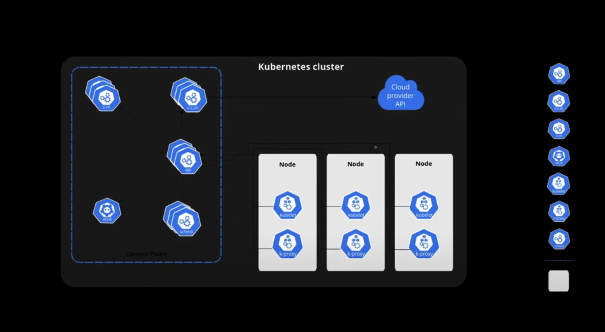

# Arquitetura de um Cluster Kubernetes



Esta imagem ilustra os principais componentes de um cluster Kubernetes, divididos em duas áreas principais: o **Control Plane** e os **Nodes**.

---

## 🔹 Kubernetes Cluster

Um **cluster Kubernetes** é formado por:

* **Control Plane (Plano de Controle)**: Gerencia o estado do cluster.
* **Nodes (Nós)**: Executam as aplicações em contêineres.

---

## 🧠 Control Plane

O Control Plane é responsável por controlar e monitorar o cluster. Ele é composto por:

* `kube-apiserver` (`api`): Interface principal de comunicação com o cluster. Todos os comandos `kubectl` passam por aqui.
* `etcd`: Armazena todos os dados persistentes do cluster em formato chave/valor.
* `kube-scheduler` (`sched`): Decide em qual nó os novos pods devem ser alocados.
* `kube-controller-manager` (`c-m`): Gerencia controladores como replicação, status de pods, etc.
* `cloud-controller-manager` (`c-c-m`): Responsável pela comunicação com o provedor de nuvem (ex: AWS, GCP).

---

## ⚙️ Nodes

Cada **nó** é uma máquina (física ou virtual) responsável por executar os containers agendados. Em cada nó, encontramos:

* `kubelet`: Agente que garante que os contêineres estejam rodando como esperado.
* `kube-proxy`: Gerencia a rede, expondo serviços para o mundo externo e roteando tráfego entre pods.

---

## ☁️ Integração com a Nuvem

O **Cloud Provider API** permite que o cluster interaja com a infraestrutura de nuvem para provisionamento automático de recursos (como volumes, IPs e balanceadores de carga).

---

> Essa arquitetura torna o Kubernetes altamente escalável, resiliente e modular.

---

## 🛠 Instalação

### 🔸 Pré-requisitos

* Docker instalado e em execução
* Acesso ao terminal com permissões de `sudo`
* Linux (x86\_64 ou ARM64)

---

### 🔹 Instalar o Kind

```bash
# Para sistemas x86_64 (Intel/AMD)
curl -Lo ./kind https://kind.sigs.k8s.io/dl/v0.28.0/kind-linux-amd64

# Para ARM64 (ex: Raspberry Pi, Apple M1/M2 via VM)
# curl -Lo ./kind https://kind.sigs.k8s.io/dl/v0.28.0/kind-linux-arm64

chmod +x ./kind
sudo mv ./kind /usr/local/bin/kind
```

---

### 🔹 Instalar o kubectl

```bash
# Baixar a versão estável mais recente
curl -LO "https://dl.k8s.io/release/$(curl -L -s https://dl.k8s.io/release/stable.txt)/bin/linux/amd64/kubectl"

chmod +x kubectl
sudo mv kubectl /usr/local/bin/
```

---

## 📦 O que é um Pod?

Um **Pod** é a menor unidade executável no Kubernetes. Ele representa um ou mais contêineres que compartilham:

* O mesmo namespace de rede (IP, portas)
* Sistema de arquivos (volumes, se definidos)
* Ciclo de vida (são criados, reiniciados e destruídos juntos)

Cada Pod é agendado para ser executado em um Node e é a forma como o Kubernetes executa e gerencia contêineres em escala.

---

## 🔍 Análise dos Pods no cluster `kind`

Abaixo está a explicação dos principais Pods listados em um cluster local baseado no Kind:

### kube-system namespace

* **coredns-**\*: Responsável pela resolução de DNS interna do cluster. Todos os serviços se comunicam pelo nome e o CoreDNS é o serviço que resolve esses nomes.

* **etcd-kind-control-plane**: Banco de dados chave/valor onde o estado de todo o cluster é armazenado. Fundamental para operações do Kubernetes.

* **kindnet-**\*: Provedor de rede padrão do Kind. Garante que todos os Pods possam se comunicar entre si.

* **kube-apiserver-kind-control-plane**: API principal do cluster. Todos os comandos e automações interagem com o cluster através desse serviço.

* **kube-controller-manager-kind-control-plane**: Gerencia controladores internos do Kubernetes, como o replicaset controller, job controller, etc.

* **kube-scheduler-kind-control-plane**: Responsável por decidir em qual nó os Pods devem ser executados.

* **kube-proxy-**\*: Executado em cada nó, responsável pelo roteamento do tráfego para os serviços (Services) definidos no cluster.

### local-path-storage namespace

* **local-path-provisioner**\*: Provedor de volumes dinâmicos baseado em paths locais. Ele cria diretórios no host para simular volumes persistentes. Usado apenas para testes locais.

---

## 🏭 E em um ambiente de produção?

Em produção, um cluster Kubernetes **não usa o Kind** (que é destinado apenas a testes locais). Em vez disso, você encontrará:

* Um ou mais nós de controle reais, em servidores ou máquinas virtuais.
* Uma rede mais robusta, como Calico, Cilium ou Weave Net, em vez do `kindnet`.
* Provisionadores de volume reais como EBS (AWS), Persistent Disk (GCP), ou Ceph, no lugar do `local-path-provisioner`.
* DNS e balanceadores de carga externos integrados ao cluster.

Os Pods continuam sendo a menor unidade de execução, mas em produção eles são mais controlados, distribuídos e escalados conforme o tráfego e necessidades de disponibilidade.

---

> Em resumo: Kind simula tudo localmente, enquanto um cluster de produção é altamente distribuído, resiliente e escalável com componentes reais e integração com infraestrutura externa.

## 🧑‍💻 Principais comandos

### **Comandos Básicos do Kubectl**

* `kubectl version` — Exibe a versão do cliente e do servidor Kubernetes.
* `kubectl get pod` — Lista os pods em execução no namespace padrão.
* `kubectl get pod -A` ou `kubectl get pod --all-namespaces` — Lista **todos os pods em todos os namespaces**.
* `kubectl get pod -o wide` ou `kubectl get pod -owide` — Lista pods com informações estendidas (IPs, nós e namespace).
* `kubectl delete pod <nome-do-pod>` — Remove um pod específico.

---

### **Criação/Simulação de Recursos**

* `kubectl run --image nginx nginx-pod` — Cria um pod chamado `nginx-pod` usando a imagem `nginx`.
* `kubectl run --image nginx --dry-run=client -o yaml nginx-pod` — Gera o YAML do pod sem criá-lo (útil para gerar manifestos).
* `kubectl apply -f pod.yaml` — Aplica a configuração definida no arquivo `pod.yaml`.

---

### **Deployments e Escalonamento**

* `kubectl create deployment --image nginx nginx-prod` — Cria um deployment `nginx-prod` com a imagem `nginx`.
* `kubectl get deployment` — Lista todos os deployments.
* `kubectl get deployment -owide` — Lista deployments com informações adicionais (como número de réplicas).
* `kubectl scale deployment nginx-prod --replicas=10` — Ajusta o número de réplicas do deployment para 10.
* `kubectl delete deploy <nome-do-deployment>` — Remove um deployment (atalho para `delete deployment`).

---

### **ReplicaSets e Debug**

* `kubectl get replicaset` — Lista ReplicaSets, que gerenciam as réplicas dos pods.
* `kubectl get node -v9` — Lista nós com nível máximo de verbosidade (logs detalhados para debug).
* `kubectl get pod -A -owide` — Lista **todos os pods** em todos os namespaces com informações estendidas (IP, nó, namespace).

---

### **Observações Importantes**

1. **Aliases:**  
   `deploy` é um alias para `deployment` (ex: `kubectl get deploy`).  
   `-owide` equivale a `-o wide` (formato de saída estendido).  

2. **Flags de Debug:**  
   A flag `-v` (verbosidade) varia de 0 a 9, sendo `-v9` o nível mais detalhado.  

3. **Gerenciamento de Recursos:**  
   Comandos como `delete pod` ou `delete deploy` removem recursos imediatamente.  
   Use `--dry-run=client` para simular operações sem alterar o cluster.

---

### Exemplo Completo de Uso

```bash
# Criar um deployment "webserver" com imagem customizada
kubectl create deployment webserver --image=mateusmuller2/webserver:0.1-878d903

# Listar pods com detalhes de IP e nó
kubectl get pod -owide

# Escalonar para 5 réplicas
kubectl scale deployment webserver --replicas=5

# Deletar o deployment e todos os pods associados
kubectl delete deploy webserver

# Gera o arquivo deployment.yaml com a definição do Deployment 'webserver' usando a imagem especificada,
# sem criar o deployment de fato no cluster (--dry-run),
# para que possa ser revisado ou editado antes da aplicação.
kubectl create deployment --image=mateusmuller2/webserver:0.1-878d903 webserver --dry-run -o yaml > deployment.yaml


```

> Esses comandos ajudam a interagir e gerenciar os recursos do cluster Kubernetes, seja para listar, criar, simular ou deletar objetos.
