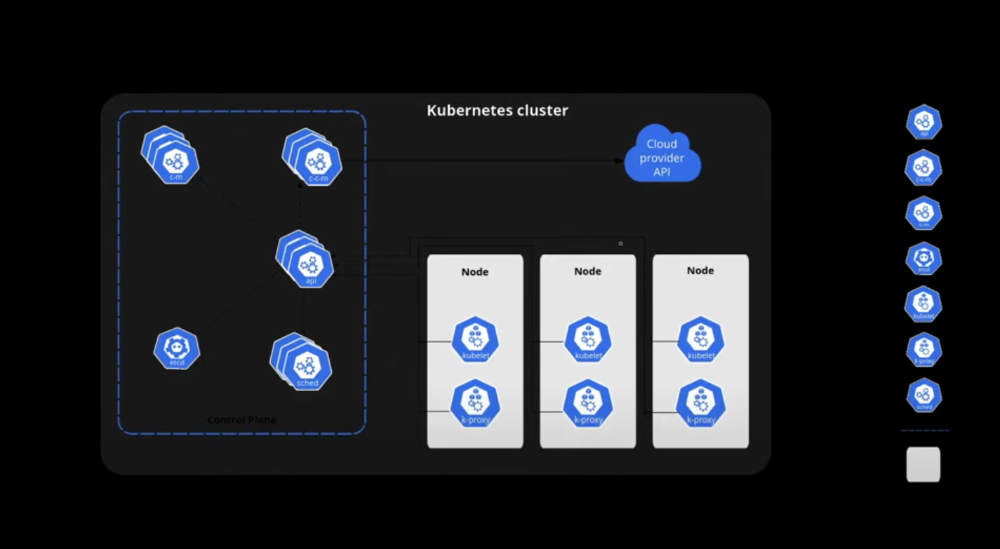

# Arquitetura de um Cluster Kubernetes

Esta imagem ilustra os principais componentes de um cluster Kubernetes, divididos em duas áreas principais: o **Control Plane** e os **Nodes**.

---

## 🔹 Kubernetes Cluster

Um **cluster Kubernetes** é formado por:

- **Control Plane (Plano de Controle)**: Gerencia o estado do cluster.
- **Nodes (Nós)**: Executam as aplicações em contêineres.

---

## 🧠 Control Plane

O Control Plane é responsável por controlar e monitorar o cluster. Ele é composto por:

- `kube-apiserver` (`api`): Interface principal de comunicação com o cluster. Todos os comandos `kubectl` passam por aqui.
- `etcd`: Armazena todos os dados persistentes do cluster em formato chave/valor.
- `kube-scheduler` (`sched`): Decide em qual nó os novos pods devem ser alocados.
- `kube-controller-manager` (`c-m`): Gerencia controladores como replicação, status de pods, etc.
- `cloud-controller-manager` (`c-c-m`): Responsável pela comunicação com o provedor de nuvem (ex: AWS, GCP).

---

## ⚙️ Nodes

Cada **nó** é uma máquina (física ou virtual) responsável por executar os containers agendados. Em cada nó, encontramos:

- `kubelet`: Agente que garante que os contêineres estejam rodando como esperado.
- `kube-proxy`: Gerencia a rede, expondo serviços para o mundo externo e roteando tráfego entre pods.

---

## ☁️ Integração com a Nuvem

O **Cloud Provider API** permite que o cluster interaja com a infraestrutura de nuvem para provisionamento automático de recursos (como volumes, IPs e balanceadores de carga).

---

> Essa arquitetura torna o Kubernetes altamente escalável, resiliente e modular.
